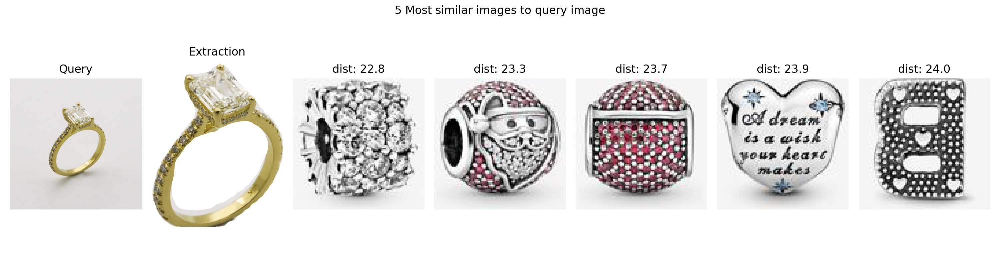

# Background

This is a repository containing our project for the course 02466 Project work - Bachelor of Artificial Intelligence and Data in Spring 2021 at The Technical University of Denmark.

The task was to create a jewellery recommendation engine that can recommend new piecs of jewellery based on a query image.


# Motivation

Say for example that you want to buy a piece of jewellery similiar to the one below but you don't know how to describe it or what exactly to search for. Instead you can search by just taking an image of the necklace and use that image to seach with.

<style>
.aligncenter {
    text-align: center;
}
</style>

<p class="aligncenter">

</p>

# Data set

Most training images are similiar to this one
<p class="aligncenter">

</p>


# How to use
Run the script ```main-run.py```
Specify an image path. The following will be output


# Necessary files
The dataset is not stored in this repo but should be located like this. It will be downloaded with the relevant script.

```
fagprojekt
└───data
```

Extra files which needs to be downloaded manually from our [drive](https://drive.google.com/file/d/1AaTLZmJ99lKCHlpNMhamrgmljf-4N1WJ/view?usp=sharing). Should be placed like so
```
fagprojekt
└───Segmentation
      model_final.pth
```
# Dependencies

```
pytorch
detectron2
pillow
opencv-python
numpy
matplotlib
sklearn
scipy
```
For a guide to install detectron check the official docs
https://detectron2.readthedocs.io/en/latest/tutorials/install.html
# Experiments

The following outlines the scripts you need to run to reproduce the results in the report

| **Script** | **Figure** |
|--------|--------|
|       |        |
